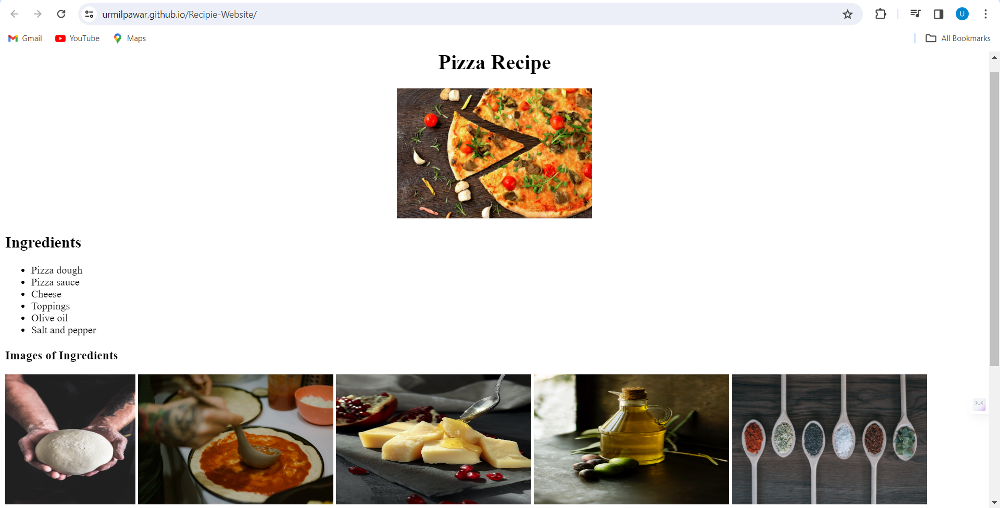
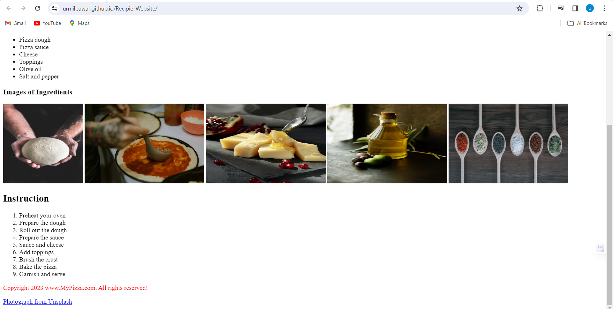

# A simple Pizza Recipe website 
This project was part of our PMKVY training which involves creating a Recipe website for any one food item for learning basic HTML concepts.

# Following are the images

